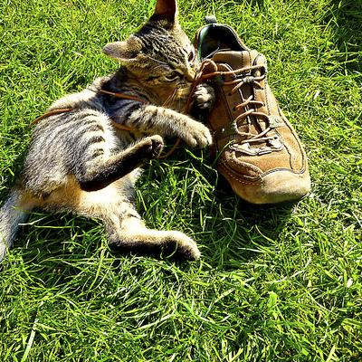
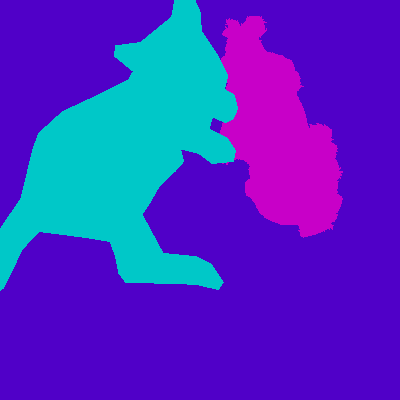
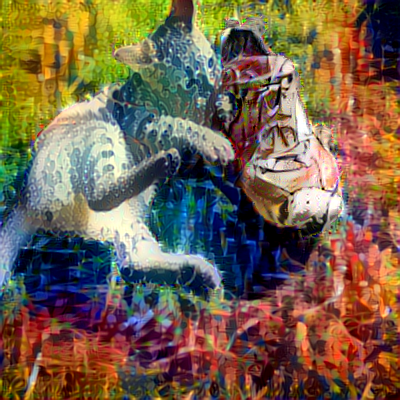
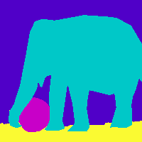
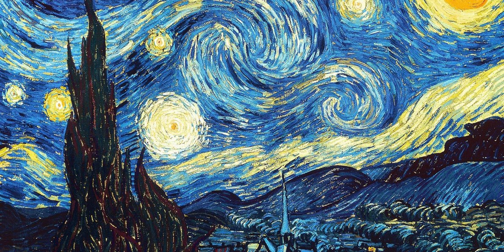
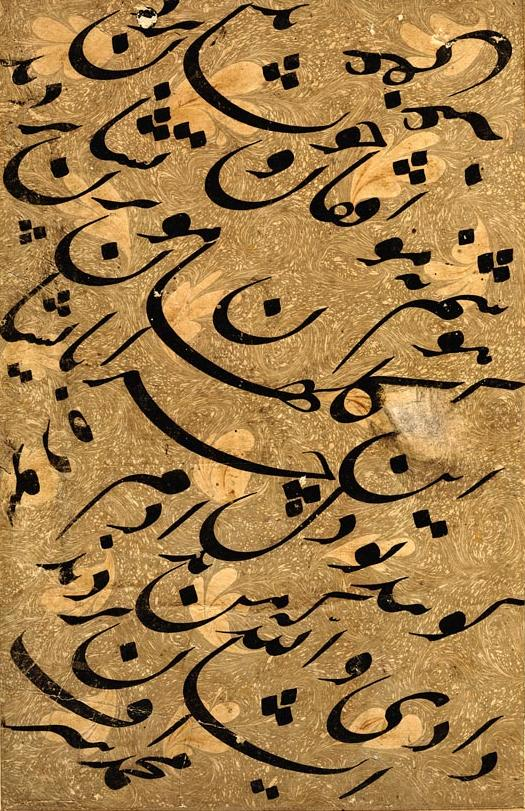
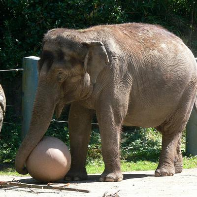
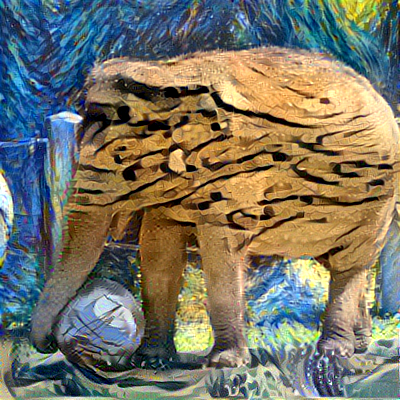

In construction...

# semantic-style-transfer
:art: :art:
**Tensorflow** implementation of **semantic style transfer** based on **guided Gram Matrices**. Our model is based on the image optimisation problem defined in [Controlling Perceptual Factors in Neural Style Transfer](https://arxiv.org/abs/1611.07865). We proposed 2 simple solutions to improve the quality of the generated images:
- Gradient capping
- Auto-tuning

## Contents
1. [Examples](#examples)
2. [Implementation Details](#implementation-details)
3. [Installation](#installation)
4. [Usage](#usage)
5. [Acknowledgements](#acknowledgements)
5. [Citation](#citation)
5. [License](#license)

## Examples
#### Full style transfer
<div align='center'>
 
 
 
</div>

#### Semantic style transfer
<div align='center'>
 
 
 
 
</div>

<div align='center'>
 
 
</div>

<div align='center'>
 
 
 
 
 
</div>

<div align='center'>
 
 
</div>

## Implementation Details

## Installation

Let's get started! **Installation** will be pretty **easy**. First, **clone a copy** of this repository:

```
git clone https://github.com/nicolastah/semantic-style-transfer
```

The next step will be to **create a new project** using your favorite python IDE. I'm personnally using [Pycharm](https://www.jetbrains.com/pycharm/). I find its integrated debugger just awesome! Last step is to install all the depedencies and you will be ready to go  :stuck_out_tongue:!

### Dependencies
- [Python 2.7](https://www.python.org/download/releases/2.7/)
- [TensorFlow](https://www.tensorflow.org)
- [SciPy](https://www.scipy.org/install.html)
- [NumPy](http://www.numpy.org)
- [Pillow](http://pillow.readthedocs.io/en/3.3.x/installation.html#installation)
- [CUDA](https://developer.nvidia.com/cuda-downloads) (**GPU**) -- Recommended
- [CUDNN](https://developer.nvidia.com/cudnn) (**GPU**) -- Recommended

I recommend creating **isolated Python environments** using [Virtualenv](https://virtualenv.pypa.io/en/stable/). **Vital** to **avoid dependencies conflicts**  :dizzy_face: when working on different projects. For those who are not familiar with Virtualenv, here are 2 tutorials that should help you get started, [tuto1](http://thepythonguru.com/python-virtualenv-guide/) and [tuto2](http://www.simononsoftware.com/virtualenv-tutorial-part-2/). The code was tested on [Ubuntu16.04](https://www.ubuntu.com/download/desktop).

 :warning: **Remarks**: 
- make sure that your **project interpreter** is **properly configured**. 
- In Pycharm you can check which interpreter is used by clicking: ```File -> Settings -> Project```. Pycharm lists all the interpreters that you have already used. If you have created a new virtual environment and want to set it as the project interpreter click on the small gear, ```Add Local``` and locate it.

### Model Weigths: VGG19
- **Download** the weights [here]( http://www.vlfeat.org/matconvnet/models/beta16/imagenet-vgg-verydeep-19.mat).
- Recall that **style transfer** is based on **perceptual losses**. Those losses allow to **separate style and content**. They are computed from **high level features**. As in the orignal work [A Neural Algorithm of Artistic Style](https://arxiv.org/abs/1508.06576), we extract those features using a **VGG19** pretrained on image classification.  

### Speed
Talk about the speed with GPU. Do it with different mage size (similar as Titus). Then do the same without GPU. Say that it is also possbile but it is slower
Can use emojie here, turtle = slow (cpu), rabbit = fast (gpu)

## Usage

Say how to pgive param script using pycharm
Put link to titu Kera implementation, say that can check his work for the tips

### Full Transfer
Use ```neural_style.py```. If ```initial``` is not specified, noise is used to begin the optimization. ```semantic-transfer``` has be set to ```False```.

```
python neural_style.py --semantic-transfer False \
 --content ./content/cat.jpg \
 --initial ./content/cat.jpg \
 --style ./style/rain_princess.jpg \
 --output ./output/cat.png
```

### Semantic Transfer
Use ```neural_style.py```. ```semantic-transfer``` has be set to ```True``` . ```semantic-styles``` represents the style images that has to be applied. 

```
python neural_style.py --semantic-transfer True \
 --content ./content/cat.jpg \
 --initial ./content/cat.jpg \
 --semantic-styles ./style/rain_princess.jpg ./style/wave.jpg ./style/ashville.jpg \
 --mask ./mask/cat3.mat
 --gradient-capping True \
 --capped_objs 1 0 0 \
 --output ./output/cat.png
```

#### Note about ```semantic-styles``` and ```mask``` 
- The number of input style has be equalled to the number of semantic regions in the content image. 
- The method works for content images with more than 2 regions.

#### Note about ```gradient-capping``` and ```capped_objs```

Can put some links to some semantic segmentation algorithms
Explain how to put the mask in my programm

## Acknowledgements
- Guided Gram Matrices is based on Gatys' paper [Controlling Perceptual Factors in Neural Style Transfer](https://arxiv.org/abs/1611.07865)
- Our implementation is based on [anishathalye/neural-style](https://github.com/anishathalye/neural-style)
- Greats tips to obtain good results from [titu1994/Neural-Style-Transfer](https://github.com/titu1994/Neural-Style-Transfer)
- Our work is an implement of XX

## Citation
```
@misc{nchung2018_semantic_style,
  author = {Chung Nicolas},
  title = {Semantic Style Transfer},
  year = {2018},
  howpublished = {\url{https://github.com/nicolastah/semantic-style-transfer}},
  note = {commit xxxxxxx}
}
```

## License
Copyright (c) 2018 Chung Nicolas. Released under GPLv3. See [LICENSE.txt](./LICENSE) for details.
